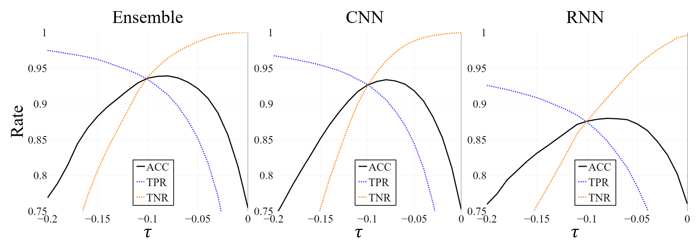

# Multimodal-Few-Shot-Learning-for-Gait-Recognition
This repository is the official implementation of Multimodal-Few-Shot-Learning-for-Gait-Recognition paper, which proposes a system that learns a mapping from a multimodal time series collected using insole to a latent space to address the open set gait recognition problem.

The code here implements an encoder-decoder network architecture that learns mapping from the input (the gait information consistent of unit steps) to a latent space (embeddings). The network utilizes two types of loss functions. The first one is based on the triplet loss function and it enforces that the distances in a latent space of homogeneous input pairs are smaller than those of heterogeneous input pairs. The second loss function minimizes the difference between reconstructed inputs and their corresponding prototypes. Only the encoder will be used in following processes after training (see process 1 in next sections).

The resultant encoder from the previous process is used to predict the embedding vectors to train one-class support vector machine (OSVM) classifiers which are used to classify the unit steps. The classifiers are thereby capable of identifying whether a unit step belongs or not to any of the known classes (see process 2 in next sections).

Also, it is implemented the analysis with Attribution map methods such as sensitivity analysis (SA) and layer-wise relevance propagation (LRP) which are available at the iNNvestigate toolbox (pypi.org/project/innvestigate/). It allows to identify the parts of the input that are relevant to the recognition performance (see process 3 in next sections).


# Requirements
Some of the main packages used for this project are Tensorflow-gpu 1.14, Keras 2.2.4, and scikit-learn 0.23.2.
It is recommended to create a new environment and install the packages listed in requirements.txt:
```
pip install -r requirements.txt
```

# Processes
The implementation is divided in different processes whose scripts are in the folder "processes" of this repository:

- <b>1. Train encoder-decoder</b>: it trains the encoder-decoder model. It saves the trained encoder and the predicted embeddings for later processes (<i>Script: 1_train_encoder-decoder.py</i>).
- <b>2. Train and test the classifier</b>: it trains the OSVM classifier with the few-shot learning method and test it with known-test and unknown test sets. It requires the predicted embeddings obtained when training the encoder-decoder. The results are saved in a CSV file for later plot and analysis (<i>Script: 2_train-test_osvm.py</i>).

# Datasets
As is shown in the following image, the data was collected from 30 subjects and it was split into three sets: 


- <b>Training set</b>: used to train the encoder-decoder network. It consists of all the unit steps of 16 individuals selected randomly.
- <b>Known-test set</b>: it contains the unit steps of 7 individuals selected randomly from the 14 remaining people after selecting the training set. This dataset is divided in two subsets. The first subset consists of 10 unit steps for each individual and it is used for training the OSVM classifier. The second subset is the remaining steps of the same 7 individuals and it is used to test the classifier as known data in the open set gait recognition problem.
- <b>Unknown test set</b>: it contains all the unit steps of the remaining 7 subjects which were not used in any training process, therefore they are unknown subjects. It is used for testing the classifier as unknown data in the open set gait recognition problem.


# Evaluation
The system is evaluated in terms of Accuracy (ACC), True Positive Rate (TPR), and True Negative Rate (TNR) defined as follows:

- 

- 

- 

Where, 
- TP stands for True Positive and it is the total unit steps in the known test set that were classified correctly. 
- FN stands for False Negative and it is the total unit steps in the known test set that were classified incorrectly. 
- TN stands for True Negative and it is the total unit steps in the unknown test set that were classified correctly as an unknown participant.
- FP stands for False Negative and it is the total unit steps in the unknown test set that were classified incorrectly as a known participant.

# Results for Gait Recognition

The following countour plots show the obtained distributions of ACC for the respective displayed lambda values as a function of the hyper-parameters gamma and nu for a fixed tau=-0.1, where the brighter yellow areas indicate rates greater than 90%. By comparing the plots, lambda=1.0 presents the broader brighter area which means the prototype loss for that lambda contributed to get a most robust system with weaker dependency respect to gamma and nu. 


The effect of different values of tau is depicted by fixing gamma=2.2 and nu=0.06 for lambda=1.0. The plot below shows that TPR and ACC get considerably enhanced at tau smaller than 0. Therefore, it is recommended to choose an alternative tau instead of tau=0.0 for the decision boundary in the latent space.



# Results for Common Attribution Map

The following plots show the performance as a function of occluding relevant positions from higher to lower (O<sub>1</sub>,...,O<sub>5</sub>) for SA and LRP-e with fixed gamma=2.2, nu=0.06, tau=-0.1, and lambda=1.0. It is observable  the overall performance degradation for both methods in terms of TPR and ACC as we move backwards from occlusion of lower relevant positions (O<sub>5</sub>) to higher ones (O<sub>1</sub>).This implies that both SA and LRP-e can detect the most important unit step regions (O<sub>1</sub>) for the known-test set.


# Contributors
Nelson Minaya nelson.minaya@student.csulb.edu <br/>
Sella Bae sella.bae@student.csulb.edu <br/>
Yong-Min Shin jordan3414@yonsei.ac.kr <br/>
Jin-Duk Park jindeok6@yonsei.ac.kr<br/>
