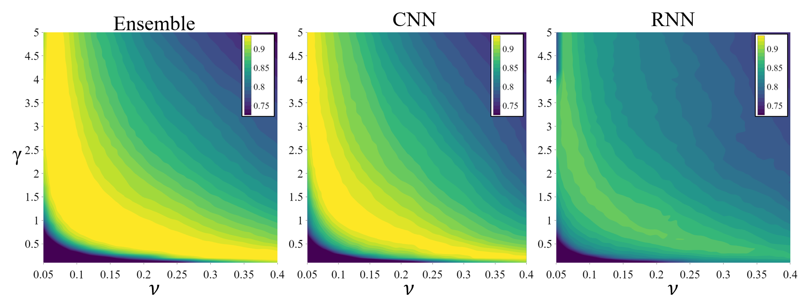
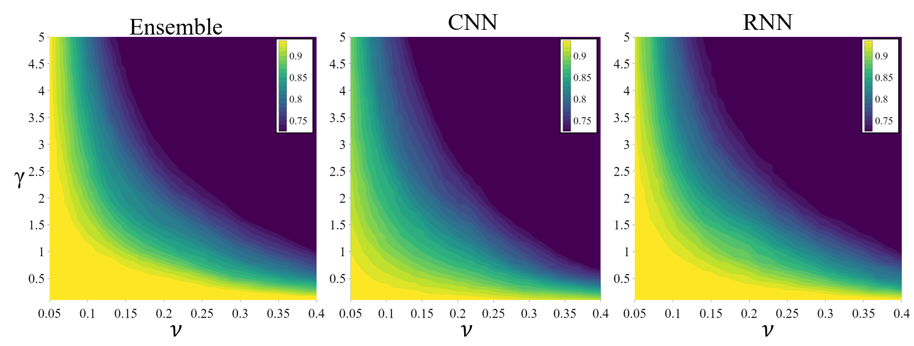
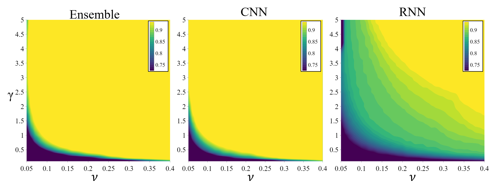

# Multimodal-Few-Shot-Learning-for-Gait-Recognition
This repository is the official implementation of Multimodal-Few-Shot-Learning-for-Gait-Recognition paper, which proposes a system that learns a mapping from a multimodal time series collected using insole to a latent space to address the open set gait recognition problem.

# Requirements
Some of the main packages used for this project are Tensorflow-gpu 1.14, Keras 2.2.4, and scikit-learn 0.23.2.
It is recommended to create a new environment and install the packages listed in requirements.txt:
```
pip install -r requirements.txt
```

# Processes
The implementation is divided in different processes whose scripts are in the folder "processes" of this repository:

- <b>1. Train encoder-decoder</b>: it trains the encoder-decoder model. It saves the trained encoder and the predicted embeddings for later processes (<i>Script: 1_train_encoder-decoder.py</i>).
- <b>2. Train and test the classifier</b>: it trains the OSVM classifier with the few-shot learning method and test it with known-test and unknown test sets. It requires the predicted embeddings obtained when training the encoder-decoder. The results are saved in a CSV file for later plot and analysis (<i>Script: 2_train-test_osvm.py</i>).

# Datasets
As is shown in the following image, the data was collected from 30 subjects and it was split into three sets: 


- <b>Training set</b>: used to train the CNN, RNN, and ensemble models independently. It consists of all the unit steps of 16 individuals selected randomly.
- <b>Unknown-Known test set</b>: it contains the unit steps of 7 individuals selected randomly from the 14 remaining people after selecting the training set. This dataset is divided in two subsets. The first subset consists of 10 unit steps for each individual and it is used for training the OSVM classifier. The second subset is the remaining steps of the same 7 individuals and it is used to test the classifier as known data in the open set gait recognition problem.
- <b>Unknown-unknown test set</b>: it contains all the unit steps of the remaining 7 subjects which were not used in any training process, therefore they are unknown subjects. It is used for testing the classifier as unknown data in the open set gait recognition problem.

# Evaluation
The system is evaluated in terms of Accuracy (ACC), True Positive Rate (TPR), and True Negative Rate (TNR) defined as follows:

- 

- 

- 

Where, 
- TP stands for True Positive and it is the total unit steps in the known test set that were classified correctly. 
- FN stands for False Negative and it is the total unit steps in the known test set that were classified incorrectly. 
- TN stands for True Negative and it is the total unit steps in the unknown test set that were classified correctly as an unknown participant.
- FP stands for False Negative and it is the total unit steps in the unknown test set that were classified incorrectly as a known participant.

# Results

The following countour plots show the obtained distributions of ACC as a function of γ and ν for the CNN, RNN, and ensemble models respectivelly. A comparison of the area in which the rates are greater than 90% (light green to yellow areas) indicates that the region of the ensemble model is broader than that of the regions of the CNN or RNN model. This means that the ensemble model has a weak dependency when selecting γ and ν, which affects the robustness of the recognition result<br/>







# Contributors
Nelson Minaya nelson.minaya@student.csulb.edu <br/>
Nhat Le nhat.le01@student.csulb.edu
